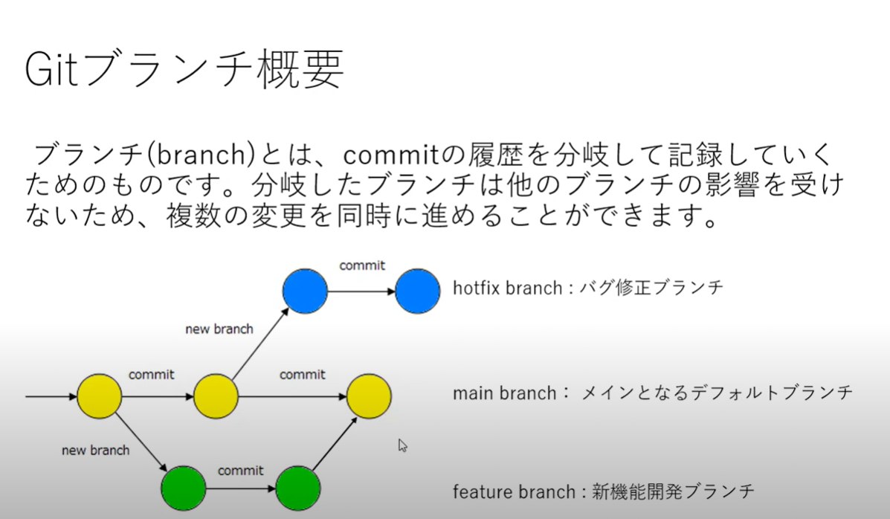
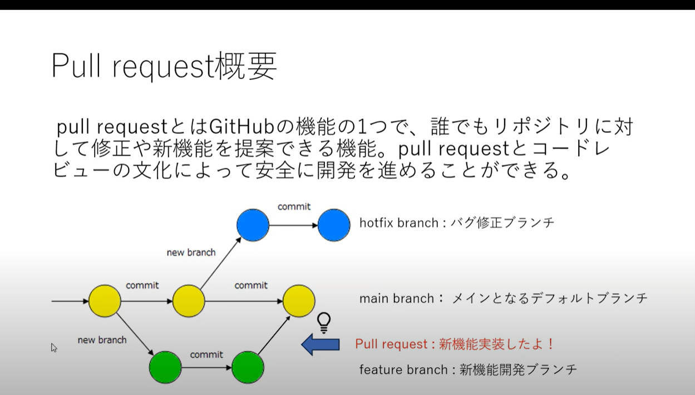
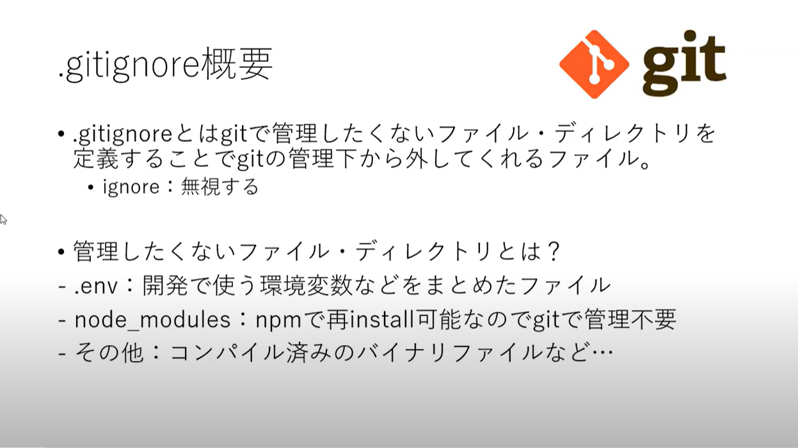
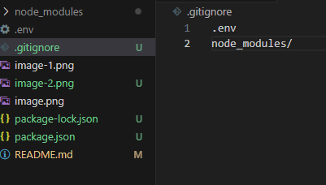

# git-tutorial

Git＋GitHubの入門

## Clone
リモートリポジトリをローカルにクローンする（複製する）

```bash
git clone git@github.com:okada-t-www/git-tutorial.git
```


## Status
リポジトリ内の変更情報を確認するコマンド

```bash
git satus
```


## Stage
ステージングエリアとはリポジトリにコミットする前のバッファリングエリア
`README.md`ファイルをステージングエリアに追加するコマンド

```bash
git add README.md
```

## Commit
Gitリポジトリ内の変更をCommit（記録）するコマンド
```bash
git commit -m "コミットメッセージ"
```

## Push
ローカルリポジトリからリモートリポジトリに
変更をpush（同期）するコマンド

```bash
git push
```

## コマンド実行履歴
ターミナルで実行したコマンドの履歴を見る
「ｑ」を押して元に戻ります
```bash
git log
```

## プッシュテスト１

## プッシュテスト２
個人アカウントでプッシュしてしまっていたためつばさのアカウントに切り替えました
```bash
git config user.email "okada.t@example.com"
```
```bash
git config user.name "OkadaTakumi"
```
既存のコミットのユーザー情報を変更する
--amendオプションを使用してコミットを修正します
（直前のコミットを修正し、著者情報をリセットします。）
```bash
git commit --amend --reset-author
```
Ctrl + Xを押してからSave modified buffer?と聞かれるので
YまたはEnterキーを押し変更を保存

★今後気をつける
ローカルリポジトリの設定:

個人用のアカウントと会社用のアカウントを使い分けるために、
ローカルのリポジトリに対して適切なリモートリポジトリを関連付けます。

git remote addコマンドを使用して、リモートリポジトリを追加します。
```bash
git remote add <個人or会社> <個人or会社URL>
```
例：
```bash
git remote add personal https://github.com/okapy0922/pushtest.git
git remote add company https://github.com/okada-t-www/git-tutorial.git
```

## Branch ブランチ概要


## ブランチ表示

ローカルブランチの一覧を表示するコマンド

```bash
git branch
```

リモートブランチの一覧を表示するコマンド

```bash
git branch -r
git branch --remotes
```

すべてのブランチを表示するコマンド

```bash
git branch -a
git branch --all
```

## ブランチ操作

`feature`というbranchを新規作成するコマンド

```bash
git branch feature
```

`feature`ブランチを削除するコマンド

```bash
git branch -d feature
```

## Checkout(ブランチを切り替える)

`feature`ブランチに切り替えるコマンド

```bash
git checkout feature
```

`feature`ブランチを新規作成して`feature`ブランチにcheckoutするコマンド

```bash
git checkout -b feature
```

## git config --global(グローバル設定の確認と変更)

グローバル設定の確認
```bash
git config --global --local --list "
```
グローバル設定の変更
```bash
git config --global user.name "okada-t-www"
git config --global user.email "okada.t@example.com"
```

## Pull request概要


## Pull
リモートでの変更をローカルに反映させるコマンド

```bash
git pull
```

## .gitignoreについて


新しいファイルを作成「.gitigore」
ファイル名を記述
フォルダ名は後ろに「/」つける

